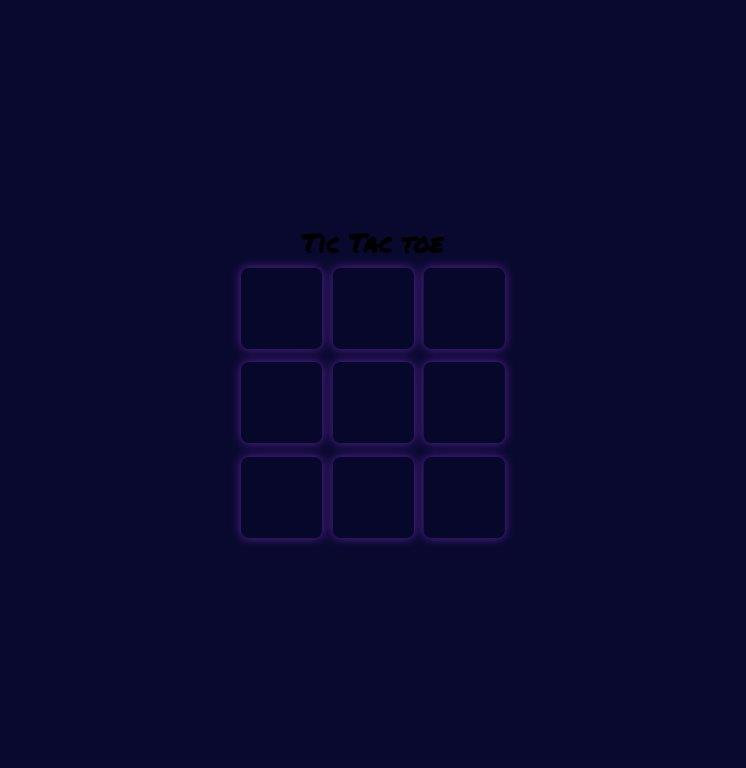
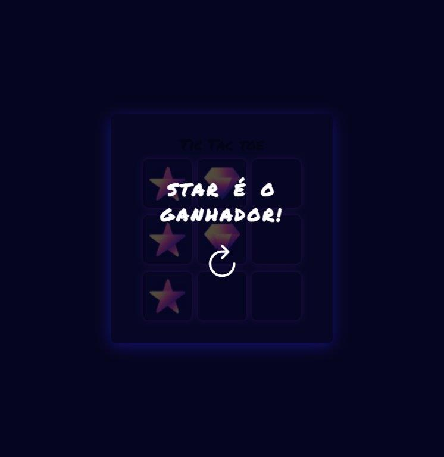

<h1> tic-tac-toe </h1>
 

this is a website that simulates the game  tic tac toe

 

# Technologies

<table align="center">
  <tr>
    <td>HTML</td>
    <td>CSS</td>
    <td>Javascript</td>

  </tr>
  <tr>
    <td>20.7%</td>
    <td>28.8%</td>
    <td>56.5%</td>

  </tr>
</table>

# Fields <!-- Campos -->
+ Game

 

# Features
- [X] Players' position
- [X] Backend
- [X] Loyalty
- [X] Restart game

<figure>
  </img>
</figure>

<figure>
  </img>
</figure>

<a align="center" href="https://gabrielwaltmann.github.io/tic-tac-toe/" target="_blank">
  <h3 align="center">Test website
</a>

# Author

 Made with by Gabriel Waltmann <a href="https://www.linkedin.com/in/gabriel-waltmann-236114232/">See my Linkedin</a>